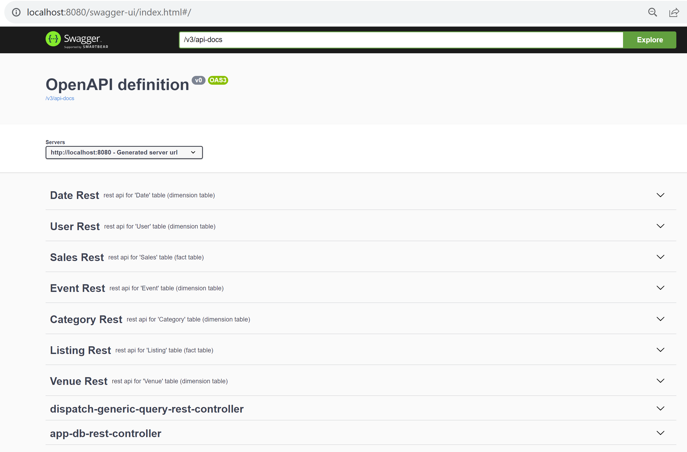

# Introduction

Simple Client + Server for exposing a "Self-BI" app on Http Rest JSON,
for exposing a sample star-schema database with 2 fact tables and 5 dimension tables. 

The csv database files are taken from Amazon Redshift sample: 
[https://docs.aws.amazon.com/redshift/latest/gsg/rs-gsg-create-sample-db.html]()
[https://docs.aws.amazon.com/redshift/latest/gsg/samples/tickitdb.zip]()

5 dimension tables:

- User
- Event
- Category
- Date
- Venue

2 Fact tables:

- Listing
- Sales


The project aim to promote generic over specific Rest APIS and UI data visualisation.

This relies on some fundamental concepts:
- schema description of tables (column name + types)
- columns metadata for PrimaryKey, ForeignKey, and other columns (maybe simple values, aggregatable values called "Measures",
  or structured columns (temporal graph, heatmap for day of week/hour, etc)
- declaration of additionnal join relationship between tables
- navigation inside object sub-fields, using joined relationships
- extension principle (like Schema stitching in GraphQL to combine several schemas)
- generic SQL query builder for "select .. from .. join .. where ... group by ... order by .. having .." 

Some comparison can be made to

- GraphQL
- Google LookerML
- PowerBI, Tableau, BusinessObject, SSAS, ..
- jdbc + SQL


# Rest Server (using Springboot + embedded Spark standalone)

Pre-requisites: java (jdk >= 17) and maven.

Preferably launch from your IDE(IntelliJ), on main java class "fr.an.test.sparkserver.Main"

Notice you need few jvm arguments for jdk>=17 to be compatible with spark (not compiled using java jigsaw modules)
```
-Xmx3g
--add-opens=java.base/java.lang=ALL-UNNAMED
... and similar other, cf doc
```

)

When launching, you can test locally using Swagger, directly from your web browser.



cf doc for server
[server/README.md](server/README.md)

The server exposes several king of Rest APIs:

7 specific apis, in a traditional Rest style
- specific query rest api for each table (typed Json)

7 query api (1 per table), where you can specify the columns to extract, like SQL "select col1,col2.. from table" 
- metadata api for specific table description, to list all available columns
- generic query rest api for specific table, choosing columns

1 generic dispatcher query: choose the tableName
- metadata api for any table given by name, to list all available columns
- generic query rest api for any table given by name, choosing columns

More to come: ... more advanced SQL query builder


# Web User-Interface (using Angular)

Pre-requisites: nodeJs (and corresponding npm)

Launch using

```
cd ui
ng serve
```
