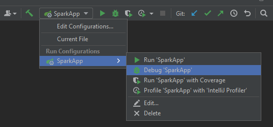
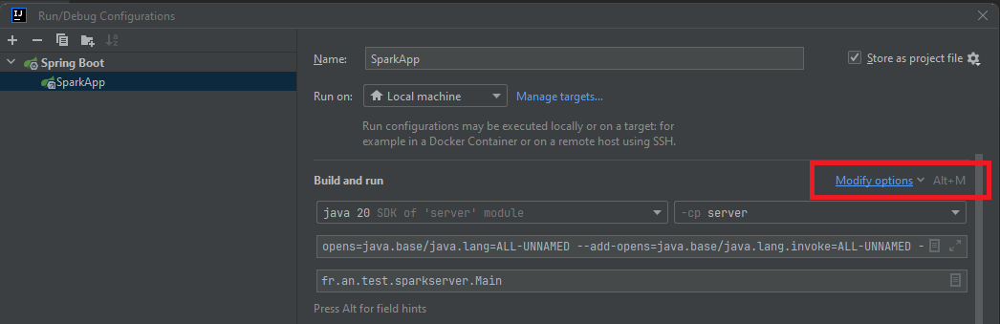
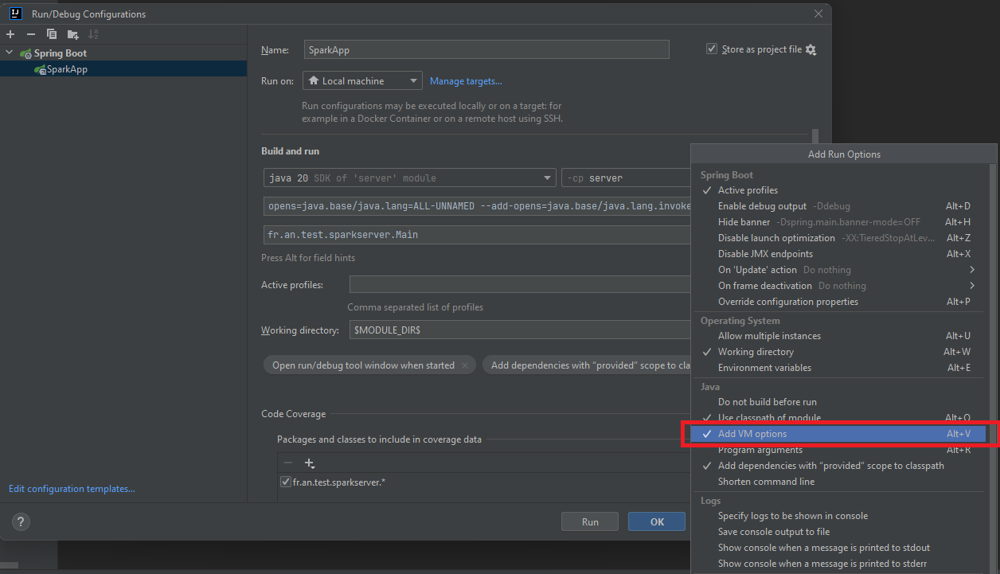
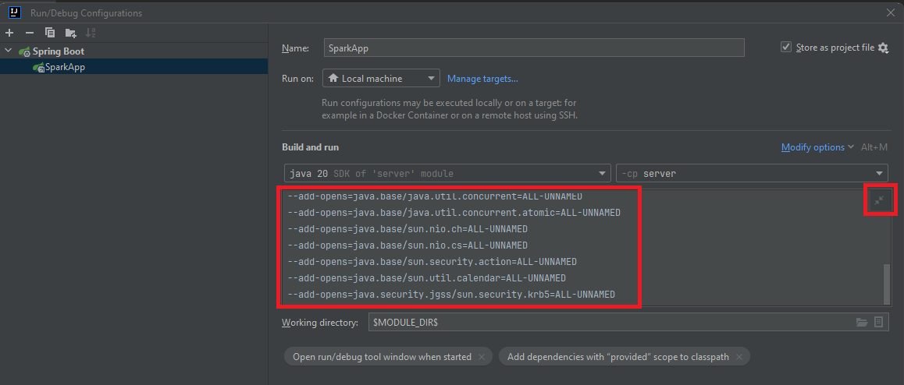
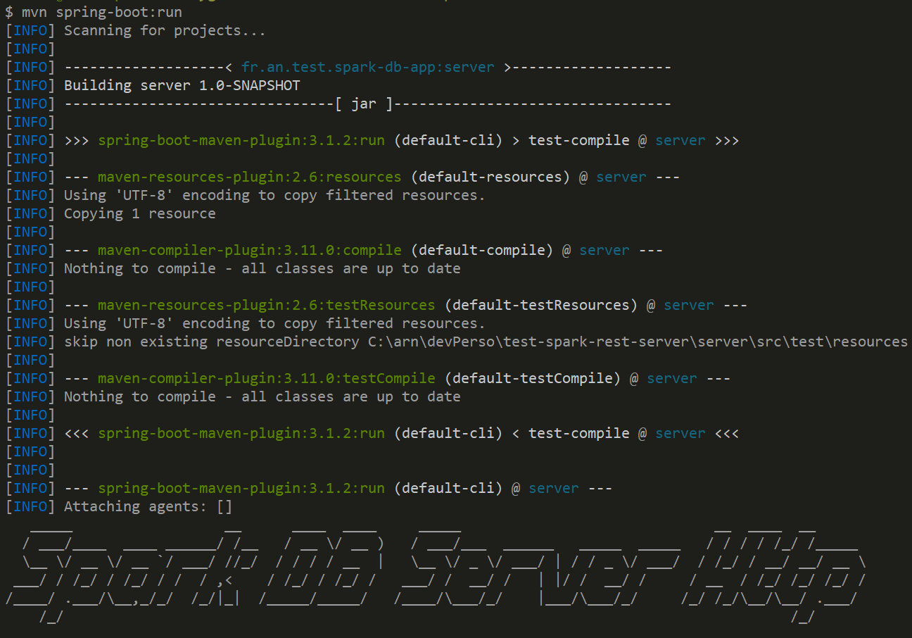
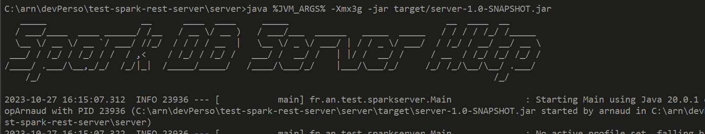

Sample Spark App exposing over Http, csv Database: https://docs.aws.amazon.com/redshift/latest/gsg/rs-gsg-create-sample-db.html

# 3 alternative ways for launching the server

## Using your IDE (IntelliJ, Eclipse, ..)

The default launcher configuration for IntelliJ is already saved in .git, under file
```
.run/SparkApp.run.xml
```

The launcher should be visible 




## Using a different IDE, or re-configuring the launcher

Select the main class "fr.an.test.sparkserver.Main"

And edit the Launcher configuration properties, to add these jvm parameters:

```
-Xmx3g
--add-opens=java.base/java.lang=ALL-UNNAMED
--add-opens=java.base/java.lang.invoke=ALL-UNNAMED
--add-opens=java.base/java.lang.reflect=ALL-UNNAMED
--add-opens=java.base/java.io=ALL-UNNAMED
--add-opens=java.base/java.net=ALL-UNNAMED
--add-opens=java.base/java.nio=ALL-UNNAMED
--add-opens=java.base/java.util=ALL-UNNAMED
--add-opens=java.base/java.util.concurrent=ALL-UNNAMED
--add-opens=java.base/java.util.concurrent.atomic=ALL-UNNAMED
--add-opens=java.base/sun.nio.ch=ALL-UNNAMED
--add-opens=java.base/sun.nio.cs=ALL-UNNAMED
--add-opens=java.base/sun.security.action=ALL-UNNAMED
--add-opens=java.base/sun.util.calendar=ALL-UNNAMED
--add-opens=java.security.jgss/sun.security.krb5=ALL-UNNAMED 
```

In IntelliJ, this is done by openning the launcher configuration >  "Edit ..." > "Modify Options" > "Add JVM Option"



Select the checkbox "Add VM Option"



Then edit the options to add all the "--add-opens=..." required by spark to work with jdk>=17.




## Launching using "mvn spring-boot:run"

Directly from your terminal, you can type
```
cd server
mvn spring-boot:run
```

It will compile then run your server directly in your terminal, within the JVM used by maven.
It may NOT be practical if you want to debug, but pretty simple if you just want to launch it.

```
[INFO] Scanning for projects...
[INFO]
[INFO] -------------------< fr.an.test.spark-db-app:server >-------------------
[INFO] Building server 1.0-SNAPSHOT
[INFO] --------------------------------[ jar ]---------------------------------
[INFO]
[INFO] >>> spring-boot-maven-plugin:3.1.2:run (default-cli) > test-compile @ server >>>
[INFO]
[INFO] --- maven-resources-plugin:2.6:resources (default-resources) @ server ---
[INFO] Using 'UTF-8' encoding to copy filtered resources.
[INFO] Copying 1 resource
[INFO]
[INFO] --- maven-compiler-plugin:3.11.0:compile (default-compile) @ server ---
[INFO] Nothing to compile - all classes are up to date
[INFO]
[INFO] --- maven-resources-plugin:2.6:testResources (default-testResources) @ server ---
[INFO] Using 'UTF-8' encoding to copy filtered resources.
[INFO] skip non existing resourceDirectory C:\arn\devPerso\test-spark-rest-server\server\src\test\resources
[INFO]
[INFO] --- maven-compiler-plugin:3.11.0:testCompile (default-testCompile) @ server ---
[INFO] Nothing to compile - all classes are up to date
[INFO]
[INFO] <<< spring-boot-maven-plugin:3.1.2:run (default-cli) < test-compile @ server <<<
[INFO]
[INFO]
[INFO] --- spring-boot-maven-plugin:3.1.2:run (default-cli) @ server ---
[INFO] Attaching agents: []
   _____                  __      ____  ____     _____                              __  ____  __
/ ___/____  ____ ______/ /__   / __ \/ __ )   / ___/___  ______   _____  _____   / / / / /_/ /_____
\__ \/ __ \/ __ `/ ___/ //_/  / / / / __  |   \__ \/ _ \/ ___/ | / / _ \/ ___/  / /_/ / __/ __/ __ \
___/ / /_/ / /_/ / /  / ,<    / /_/ / /_/ /   ___/ /  __/ /   | |/ /  __/ /     / __  / /_/ /_/ /_/ /
/____/ .___/\__,_/_/  /_/|_|  /_____/_____/   /____/\___/_/    |___/\___/_/     /_/ /_/\__/\__/ .___/
/_/                                                                                      /_/

(...truncated logs ... same as other launch methods)
```




## Launching as a plain old "java -jar "

You can also launch the server, directly as "java -jar ...", using the fat-jar produced by spring-boot-maven-plugin.

SEe at compile-time, your small jar in target/*.jar is repackaged as a fat jar :
```
mvn package
...
[INFO] --- spring-boot-maven-plugin:3.1.2:repackage (repackage) @ server ---
[INFO] Replacing main artifact C:\test-spark-rest-server\server\target\server-1.0-SNAPSHOT.jar with repackaged archive, adding nested dependencies in BOOT-INF/.
[INFO] The original artifact has been renamed to C:\test-spark-rest-server\server\target\server-1.0-SNAPSHOT.jar.original
```

To launch it, 
```
cd server
set JVM_ARGS=--add-opens=java.base/java.lang=ALL-UNNAMED --add-opens=java.base/java.lang.invoke=ALL-UNNAMED --add-opens=java.base/java.lang.reflect=ALL-UNNAMED --add-opens=java.base/java.io=ALL-UNNAMED --add-opens=java.base/java.net=ALL-UNNAMED --add-opens=java.base/java.nio=ALL-UNNAMED --add-opens=java.base/java.util=ALL-UNNAMED --add-opens=java.base/java.util.concurrent=ALL-UNNAMED --add-opens=java.base/java.util.concurrent.atomic=ALL-UNNAMED --add-opens=java.base/sun.nio.ch=ALL-UNNAMED --add-opens=java.base/sun.nio.cs=ALL-UNNAMED --add-opens=java.base/sun.security.action=ALL-UNNAMED --add-opens=java.base/sun.util.calendar=ALL-UNNAMED --add-opens=java.security.jgss/sun.security.krb5=ALL-UNNAMED

java %JVM_ARGS% -Xmx3g -jar target/server-1.0-SNAPSHOT.jar 
```




# Sample startup logs

When the application starts, it logs:
```
   _____                  __      ____  ____     _____                              __  ____  __
  / ___/____  ____ ______/ /__   / __ \/ __ )   / ___/___  ______   _____  _____   / / / / /_/ /_____
  \__ \/ __ \/ __ `/ ___/ //_/  / / / / __  |   \__ \/ _ \/ ___/ | / / _ \/ ___/  / /_/ / __/ __/ __ \
 ___/ / /_/ / /_/ / /  / ,<    / /_/ / /_/ /   ___/ /  __/ /   | |/ /  __/ /     / __  / /_/ /_/ /_/ /
/____/ .___/\__,_/_/  /_/|_|  /_____/_____/   /____/\___/_/    |___/\___/_/     /_/ /_/\__/\__/ .___/
    /_/                                                                                      /_/

2023-10-27 15:54:40.256  INFO 13952 --- [           main] fr.an.test.sparkserver.Main              : Starting Main using Java 19.0.1 on DesktopArnaud with PID 13952 (C:\arn\devPerso\test-spark-rest-server\server\target\classes started by arnaud in C:\arn\devPerso\test-spark-rest-server\server)
2023-10-27 15:54:40.259  INFO 13952 --- [           main] fr.an.test.sparkserver.Main              : No active profile set, falling back to 1 default profile: "default"
2023-10-27 15:54:41.114  INFO 13952 --- [           main] o.s.b.w.embedded.tomcat.TomcatWebServer  : Tomcat initialized with port(s): 8080 (http)
2023-10-27 15:54:41.122  INFO 13952 --- [           main] o.apache.catalina.core.StandardService   : Starting service [Tomcat]
2023-10-27 15:54:41.124  INFO 13952 --- [           main] org.apache.catalina.core.StandardEngine  : Starting Servlet engine: [Apache Tomcat/9.0.78]
2023-10-27 15:54:41.254  INFO 13952 --- [           main] o.a.c.c.C.[Tomcat].[localhost].[/]       : Initializing Spring embedded WebApplicationContext
2023-10-27 15:54:41.254  INFO 13952 --- [           main] w.s.c.ServletWebServerApplicationContext : Root WebApplicationContext: initialization completed in 955 ms
2023-10-27 15:54:41.309  INFO 13952 --- [           main] f.a.t.s.configuration.AppConfiguration   : detected environment variable HADOOP_HOME : C:\apps\spark\spark-3.4.1-bin-hadoop3
2023-10-27 15:54:41.732  WARN 13952 --- [           main] org.apache.hadoop.util.NativeCodeLoader  : Unable to load native-hadoop library for your platform... using builtin-java classes where applicable
2023-10-27 15:54:42.630  INFO 13952 --- [           main] f.a.t.s.configuration.AppConfiguration   : loading dimension tables: users, event, category, date2008, venue (should be broadcast)
2023-10-27 15:54:42.682  WARN 13952 --- [           main] o.apache.spark.sql.internal.SharedState  : URL.setURLStreamHandlerFactory failed to set FsUrlStreamHandlerFactory
2023-10-27 15:54:46.177  INFO 13952 --- [           main] f.a.t.s.configuration.AppConfiguration   : loaded csv file 'users' count: 49990
2023-10-27 15:54:46.434  INFO 13952 --- [           main] f.a.t.s.configuration.AppConfiguration   : loaded csv file 'event' count: 8798
2023-10-27 15:54:46.550  INFO 13952 --- [           main] f.a.t.s.configuration.AppConfiguration   : loaded csv file 'category' count: 11
2023-10-27 15:54:46.704  INFO 13952 --- [           main] f.a.t.s.configuration.AppConfiguration   : loaded csv file 'date2008' count: 365
2023-10-27 15:54:46.820  INFO 13952 --- [           main] f.a.t.s.configuration.AppConfiguration   : loaded csv file 'venue' count: 202
2023-10-27 15:54:46.820  INFO 13952 --- [           main] f.a.t.s.configuration.AppConfiguration   : loading facts tables: listings, sales (should not be broadcast/cached if too big)
2023-10-27 15:54:46.830  INFO 13952 --- [           main] f.a.t.s.configuration.AppConfiguration   : lazy-load Dataset for csv file 'listing'
2023-10-27 15:54:46.840  INFO 13952 --- [           main] f.a.t.s.configuration.AppConfiguration   : lazy-load Dataset for csv file 'sales'
2023-10-27 15:54:46.840  INFO 13952 --- [           main] f.a.t.s.configuration.AppConfiguration   : register as global temporary view (replace metastore..)
2023-10-27 15:54:46.840  INFO 13952 --- [           main] f.a.t.s.configuration.AppConfiguration   : register spark DataSet<Row> userDs as global temp view 'user'
2023-10-27 15:54:46.867  INFO 13952 --- [           main] f.a.t.s.configuration.AppConfiguration   : register spark DataSet<Row> eventDs as global temp view 'event'
2023-10-27 15:54:46.871  INFO 13952 --- [           main] f.a.t.s.configuration.AppConfiguration   : register spark DataSet<Row> categoryDs as global temp view 'category'
2023-10-27 15:54:46.877  INFO 13952 --- [           main] f.a.t.s.configuration.AppConfiguration   : register spark DataSet<Row> dateDs as global temp view 'date'
2023-10-27 15:54:46.887  INFO 13952 --- [           main] f.a.t.s.configuration.AppConfiguration   : register spark DataSet<Row> venueDs as global temp view 'venue'
2023-10-27 15:54:46.894  INFO 13952 --- [           main] f.a.t.s.configuration.AppConfiguration   : register spark DataSet<Row> listingDs as global temp view 'listing'
2023-10-27 15:54:46.899  INFO 13952 --- [           main] f.a.t.s.configuration.AppConfiguration   : register spark DataSet<Row> salesDs as global temp view 'sales'
2023-10-27 15:54:47.349  INFO 13952 --- [           main] o.s.b.w.embedded.tomcat.TomcatWebServer  : Tomcat started on port(s): 8080 (http) with context path ''
2023-10-27 15:54:47.357  INFO 13952 --- [           main] fr.an.test.sparkserver.Main              : Started Main in 7.461 seconds (JVM running for 7.823)
```


# use Swagger OpenApi 3:

open http://localhost:8080/swagger-ui.html

notice it will redirect you to page
http://localhost:8080/swagger-ui/index.html#/
and also fill "/v3/api-docs"


# Example of generic query:

```
http://localhost:8080/swagger-ui/index.html#/Sales%20Rest/query
{
    "limit": 10,
    "exprs": [
        "salesId", "listId"
    ]
}
```

Result:
```
[
  {
    "cols": [
      1,
      1
    ]
  },
  {
    "cols": [
      2,
      4
    ]
  },
  ...
```